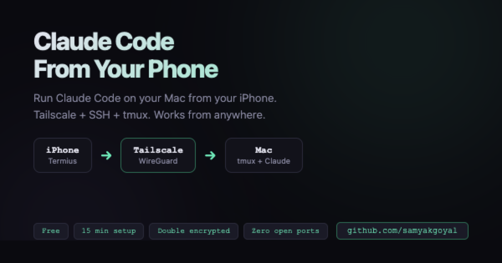

[](https://github.com/samyakgoyal/claude-code-from-phone/stargazers)
[](LICENSE)
[](https://samyakgoyal.github.io/claude-code-from-phone/)

# Claude Code From Your Phone

Run [Claude Code](https://docs.anthropic.com/en/docs/claude-code) on your Mac from your iPhone. From anywhere. Couch, coffee shop, bed, train — even the bathroom stall during a standup you forgot to mute.

**[Read the full guide &rarr;](https://samyakgoyal.github.io/claude-code-from-phone/)**

<a href="https://samyakgoyal.github.io/claude-code-from-phone/">
  
</a>

## How it works

```
iPhone (Termius) → Tailscale (WireGuard tunnel) → Mac (tmux + Claude Code)
```

Your Mac stays plugged in and awake. Your phone becomes a window into its terminal. One command (`sg`), you're in. Close the app, walk away, come back hours later — session is exactly where you left it.

## The stack

| Tool | What it does | Cost |
|------|-------------|------|
| **Tailscale** | Private encrypted network between your devices. No open ports. | Free |
| **Termius** | SSH client for iPhone. Terminal on your phone, but prettier. | Free |
| **tmux** | Keeps sessions alive when you disconnect. Pause button for terminals. | Free |
| **SSH** | The actual connection. Built into macOS since before you were born (probably). | Free |

**Total cost: $0 &middot; Setup time: ~15 min &middot; Productivity lost to "let me just check one thing": immeasurable**

## Quick setup

1. **Tailscale** — Install on Mac + iPhone, sign in with same account
2. **SSH** — System Settings → General → Sharing → Remote Login → ON
3. **Termius** — Add a host with your Tailscale IP + Mac username
4. **tmux** — `brew install tmux` + the magic alias below
5. **Stay awake** — Prevent Mac from sleeping

```bash
# The magic alias (run once)
echo "alias sg='tmux attach -t claude || tmux new -s claude'" >> ~/.zshrc && source ~/.zshrc
```

Then from anywhere: **Termius → `sg` → you're coding**

## Security

- Zero open ports on your Mac — invisible to the public internet
- Double encrypted: WireGuard (ChaCha20) + SSH (AES-256)
- Only your Tailscale devices can reach your Mac
- More secure than direct SSH with port forwarding

For someone to break in, they'd need to compromise your Tailscale account, know your Tailscale IP, AND crack your SSH credentials — simultaneously. If someone can pull all that off, they don't need your terminal.

## The full guide covers

- Step-by-step setup with copy-paste commands
- How encryption flows through every layer
- Troubleshooting (connection drops, sleep issues, VPN conflicts)
- Platform alternatives (Android, Windows, Linux, iPad)
- Power user tips (SSH keys, Mosh, better tmux config)

**[Read it here &rarr;](https://samyakgoyal.github.io/claude-code-from-phone/)**

## Contributing

Want to help? Check out the [contributing guide](CONTRIBUTING.md). TL;DR: issues for bugs, PRs for fixes, and if you got this working on Android, we want to hear about it.

---

Built by [Samyak Goyal](https://github.com/samyakgoyal) — who wanted to ship code without leaving the couch. The code doesn't care where you are. Neither should you.
