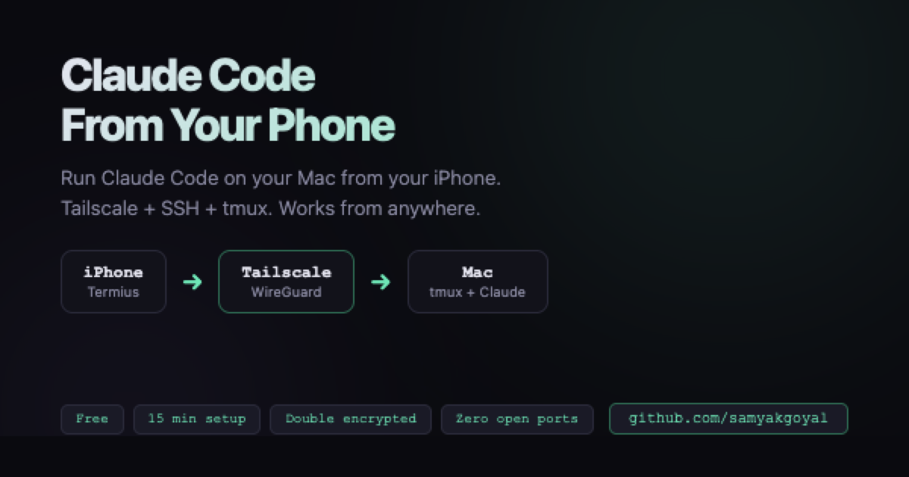

[](https://github.com/samyakgoyal/claude-code-from-phone/stargazers)
[](LICENSE)
[](https://samyakgoyal.github.io/claude-code-from-phone/)

# Claude Code From Your Phone

Run [Claude Code](https://docs.anthropic.com/en/docs/claude-code) on your Mac from your iPhone. No cloud VM, no monthly bill, no exposed ports. Just your devices, connected.

**[Read the full guide &rarr;](https://samyakgoyal.github.io/claude-code-from-phone/)**

<a href="https://samyakgoyal.github.io/claude-code-from-phone/">
  
</a>

## How it works

```
iPhone (Termius) → Tailscale (WireGuard tunnel) → Mac (tmux + Claude Code)
```

Your Mac stays plugged in and awake. Your phone becomes a window into its terminal. One command (`cc`), you're in. Close the app, walk away, come back hours later — session is exactly where you left it.

## Why this over Claude Code Remote?

|                         | This Setup | Cloud VM        | claude.ai/code |
| ----------------------- | ---------- | --------------- | -------------- |
| **Monthly cost**        | $0         | $20–100+        | Pro sub        |
| **Your local files**    | Yes        | No              | No             |
| **Open ports**          | Zero       | Port 22 exposed | N/A            |
| **Persistent sessions** | Yes (tmux) | Yes (tmux)      | No             |
| **Works offline (LAN)** | Yes        | No              | No             |
| **Setup time**          | 15 min     | 30–60 min       | 0              |

**Bottom line:** If you have a Mac and want to code from your phone, this gives you full access to your own machine for free. Cloud VMs make sense for teams. The web app is great for quick prompts. This is for when you want _your_ terminal, _your_ files, from _your_ phone.

## The stack

| Tool          | What it does                                                   | Cost |
| ------------- | -------------------------------------------------------------- | ---- |
| **Tailscale** | Private encrypted network between your devices. No open ports. | Free |
| **Termius**   | SSH client for iPhone. Full terminal on your phone.            | Free |
| **tmux**      | Keeps sessions alive when you disconnect.                      | Free |
| **SSH**       | The actual connection. Built into macOS.                       | Free |

**Total cost: $0 · Setup time: ~15 min**

## Quick setup

1. **Tailscale** — Install on Mac + iPhone, sign in with same account
2. **SSH** — System Settings → General → Sharing → Remote Login → ON
3. **Termius** — Add a host with your Tailscale IP + Mac username
4. **tmux** — `brew install tmux` + the alias below
5. **Stay awake** — Prevent Mac from sleeping

```bash
# The magic alias (run once)
echo "alias cc='tmux attach -t claude || tmux new -s claude'" >> ~/.zshrc && source ~/.zshrc
```

Then from anywhere: **Termius → `cc` → you're coding**

## Security

- Zero open ports — invisible to the public internet
- Double encrypted: WireGuard (ChaCha20) + SSH (AES-256)
- Only your Tailscale devices can reach your Mac
- More secure than direct SSH with port forwarding

An attacker would need to compromise your Tailscale account, know your Tailscale IP, AND crack your SSH credentials — simultaneously.

## The full guide covers

- Step-by-step setup with copy-paste commands
- Side-by-side comparison with cloud VMs and claude.ai/code
- How encryption flows through every layer
- Troubleshooting (connection drops, sleep issues, VPN conflicts)
- Platform alternatives (Android, Windows, Linux, iPad)
- Power user tips (SSH keys, Mosh, better tmux config)

**[Read it here &rarr;](https://samyakgoyal.github.io/claude-code-from-phone/)**

## Contributing

Found an issue or want to improve the guide? Check out the [contributing guide](CONTRIBUTING.md).

---

Built by [Samyak Goyal](https://github.com/samyakgoyal) · MIT Licensed
